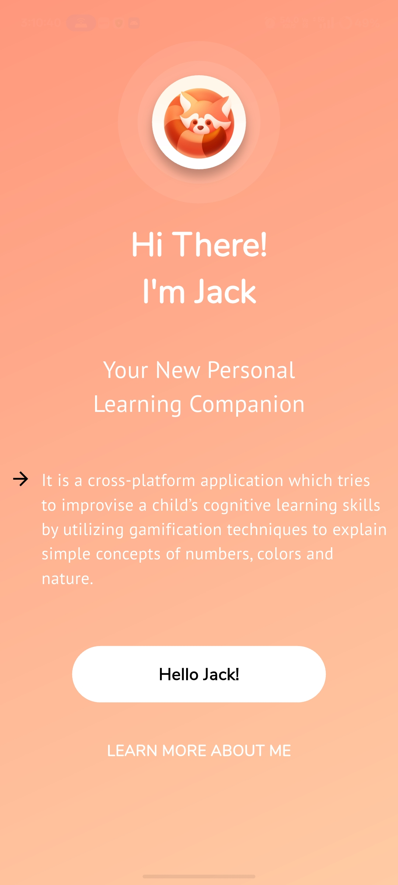
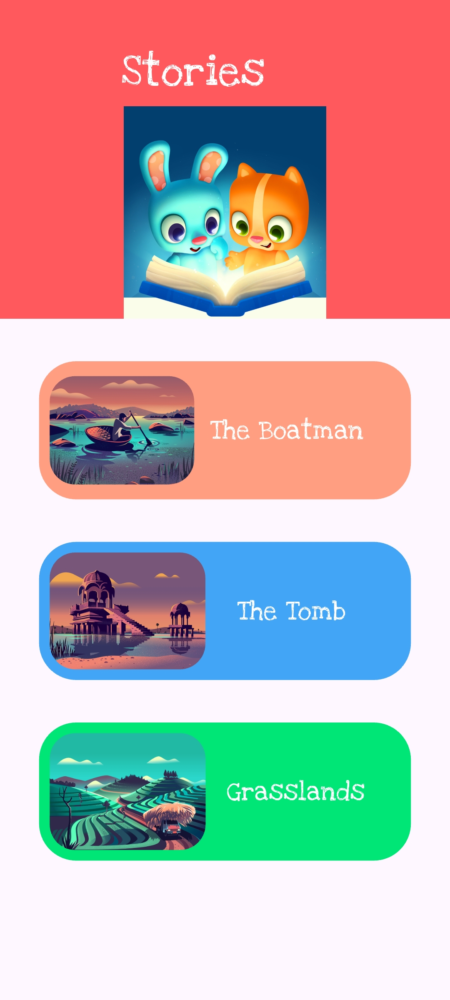
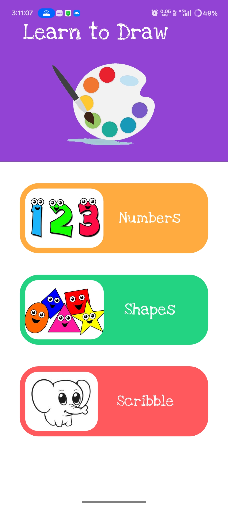
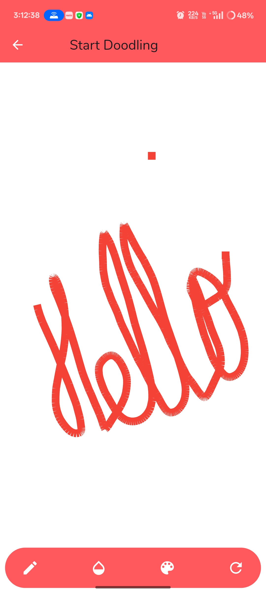
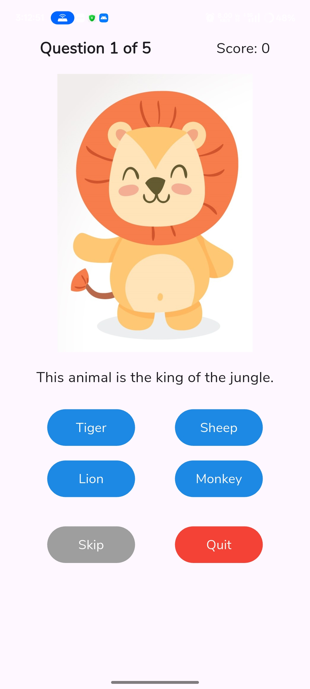
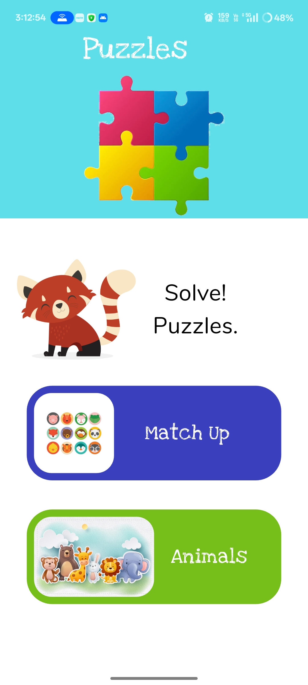
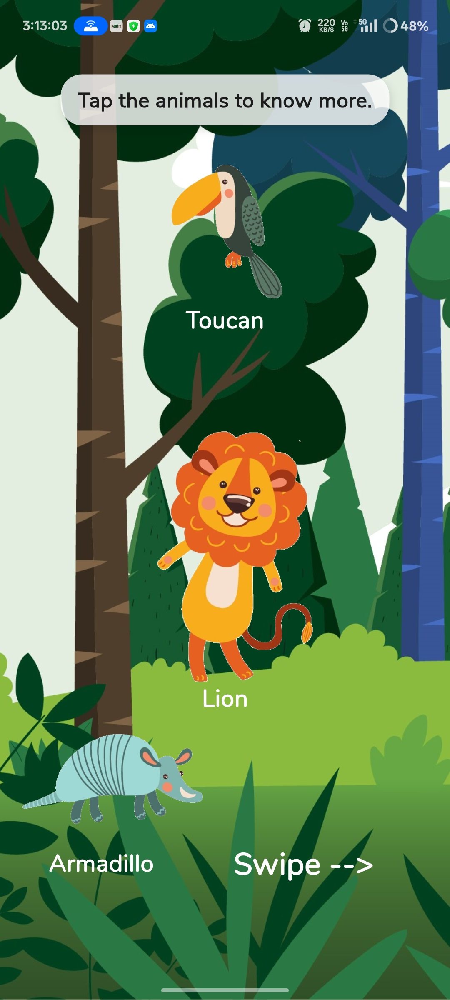
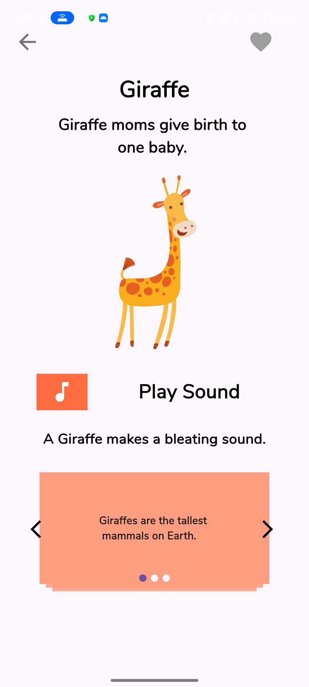
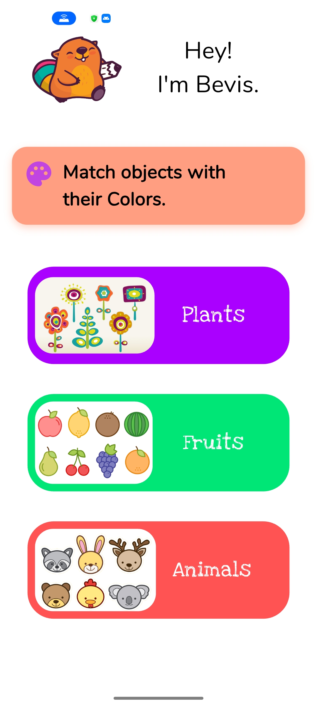

# 🧠 Alpha Mind

**A Play-Learning App for Special Kids**  
Empowering cognitive learning through interactive games, stories, quizzes, and puzzles—designed especially for children with special educational needs.

---

## 📌 Problem Statement

Supporting children with autism, dyslexia, Down syndrome, ADHD, and other learning difficulties calls for specialized teaching resources and empathy. Many educational apps fall short, offering cluttered UIs, limited gamification, and no inclusivity for diverse learners.

---

## 🚀 Key Features

- 🎮 **Gamified Learning Modules** – Interactive activities to build memory, attention, and logic.
- 📖 **Visual Storytelling** – Narrated stories with accessible UI and animations.
- 🎨 **Creative Canvas** – Drawing and scribbling tools to foster expression.
- ❓ **Cognitive Quizzes & Matching Puzzles** – Reinforce visual recognition and recall.
- 🦁 **Animal Explorer** – Learn animal facts through rich audio-visual cues.
- 🧠 **Low Cognitive Load UI/UX** – Built on principles of accessibility and minimal design.

Rich animations, clear UI, and thoughtful audio cues create a focused and engaging environment.

---

## 🛠️ Tech Stack

| Layer          | Technology                                           |
|----------------|------------------------------------------------------|
| Frontend       | Flutter (Dart) – Cross-platform development          |
| State Mgmt     | Provider / Riverpod (for scalability and modularity) |
| Multimedia     | Custom Audio/Video Assets, Lottie Animations         |
| Design System  | Material 3 + Custom Animations & Accessibility APIs  |

---

## 📸 App Screenshots

<table>
  <tr>
    <td align="center">
      <b>🏠 Home Screen</b>
       
       
    </td>
    <td align="center">
      <b>📘 Intro Page</b>
       
        
    </td>
    <td align="center">
      <b>📚 Courses Page</b>
       
        
    </td>
  </tr>
  <tr>
    <td align="center">
      <b>📖 Stories Section</b>
       
        
    </td>
    <td align="center">
      <b>🎨 Drawing Screen</b>
       
        
    </td>
    <td align="center">
      <b>🖌️ Scribble Pad</b>
       
        
    </td>
  </tr>
  <tr>
    <td align="center">
      <b>❓ Quiz Screen</b>
       
        
    </td>
    <td align="center">
      <b>🧩 Puzzle Start</b>
       
        
    </td>
    <td align="center">
      <b>🦁 Animals Puzzle</b>
       
        
    </td>
  </tr>
  <tr> 
    <td align="center">
      <b>🐾 Animal Details after clicking animals</b>
       
        
    </td>
    <td align="center" colspan="2">
      <b>🔄 Matchup Puzzle</b>
       
    </td>
  </tr>
</table>

---

## 🙋‍♀️ About the Author

**Khushbu Rani**  
B.Tech CSE Student @ VIT  
Machine Learning Enthusiast  
GitHub: [@khushbu0810](https://github.com/khushbu0810)  
