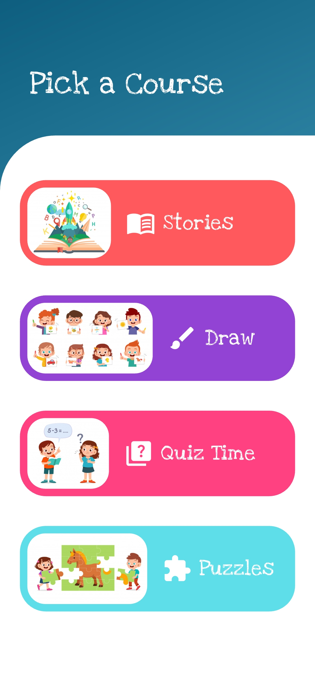

## 📸 App Screenshots

<table>
  <tr>
    <td align="center">
       
      <b>🏠 Home Screen</b>
    </td>
    <td align="center">
       
      <b>📘 Intro Page</b>
    </td>
  </tr>
  <tr>
    <td align="center">
       
      <b>📚 Courses Page</b>
    </td>
    <td align="center">
       
      <b>📖 Stories Section</b>
    </td>
  </tr>
  <tr>
    <td align="center">
       
      <b>🎨 Drawing Screen</b>
    </td>
    <td align="center">
       
      <b>🖌️ Scribble Pad</b>
    </td>
  </tr>
  <tr>
    <td align="center">
       
      <b>❓ Quiz Screen</b>
    </td>
    <td align="center">
       
      <b>🧩 Puzzle Start</b>
    </td>
  </tr>
  <tr>
    <td align="center" colspan="2">
       
      <b>🔄 Matchup Puzzle</b>
    </td>
    <td align="center">
       
      <b>🦁 Animals Puzzle</b>
    </td>
  </tr>
  <tr>
    <td align="center">
       
      <b>🐾 Animal Details after clicking any animal</b>
    </td>
  </tr>
</table>
